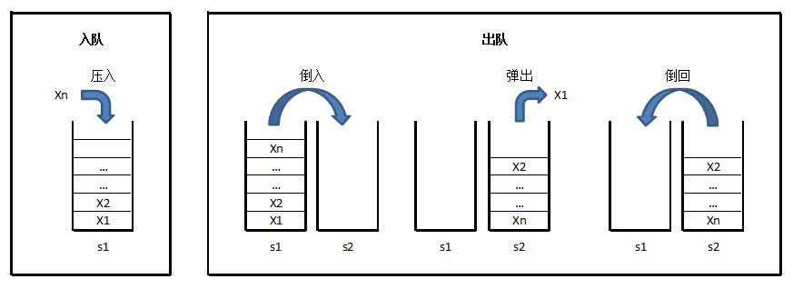

# 题目描述 #
## 两个栈实现一个队列 ##
```java
	public class Solution {
	    Stack<Integer> stack1 = new Stack<Integer>();
	    Stack<Integer> stack2 = new Stack<Integer>();
	
	    public void push(int node) {
	        stack1.push(node);
	    }
	
	    public int pop() {
			Integer p=null;
	        while(!(stack1.empty())){
	            stack2.push(stack1.pop());
	        }
	        p = stack2.pop();
	        while(!(stack2.empty())){
	            stack1.push(stack2.pop());
	        }
	        return p;
	    }
	}
```

----------

- 思路1：始终维护s1作为存储空间，以s2作为临时缓冲区
入队时，将元素压入s1。
出队时，将s1的元素逐个“倒入”（弹出并压入）s2，将s2的顶元素弹出作为出队元素，之后再将s2剩下的元素逐个“倒回”s1。

- 思路2：s1是入栈的，s2是出栈的
在出队时，将s1的元素逐个“倒入”s2时，原在s1栈底的元素，不用“倒入”s2（即只“倒”s1.Count()-1个），可直接弹出作为出队元素返回。这样可以减少一次压栈的操作。
- 思路3：s1是入栈的，s2是出栈的
入队时，先判断s1是否为空，如不为空，说明所有元素都在s1，此时将入队元素直接压入s1；如为空，要将s2的元素逐个“倒回”s1，再压入入队元素。
出队时，先判断s2是否为空，如不为空，直接弹出s2的顶元素并出队；如为空，将s1的元素逐个“倒入”s2，把最后一个元素弹出并出队。
- 思路4：s1是入栈的，s2是出栈的（最佳）
入队时，将元素压入s1。
出队时，判断s2是否为空，如不为空，则直接弹出顶元素；如为空，则将s1的元素逐个“倒入”s2，把最后一个元素弹出并出队。
这个思路，避免了反复“倒”栈，仅在需要时才“倒”一次。

